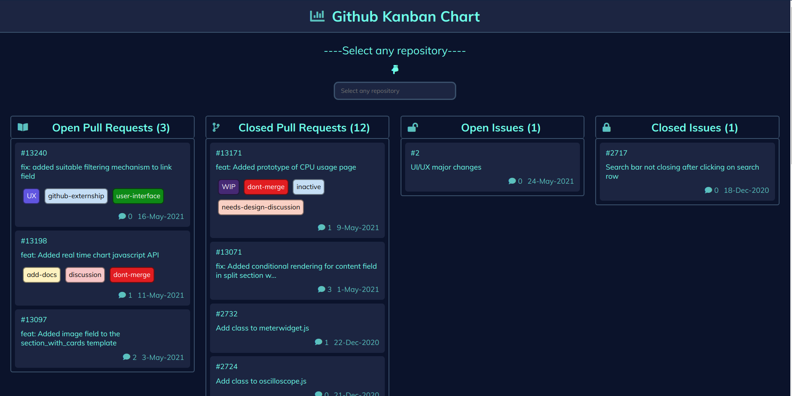

# Github Kanban Chart

### Now easily share your open-source contributions to anyone in the form of a kanban chart which looks very visually appealing to the eyes.

 
  

### Features

:heart: **Lightweight and minimal**: Crafted with minimalistic UI design.

:electric_plug: **All contributions**: Shows off all your open and closed pull requests/issues in the form of kanban chart.

:zap: **Instant search**: Search for any repository and it's associated contributions.

## Demo

[https://codescientist703.github.io/github-kanban/](https://codescientist703.github.io/github-kanban/)

In the URL type https://codescientist703.github.io/github-kanban/?user=your_username and replace your_username with your github username to get your own personalized page which you can show off to anyone.

## Built with

- HTML - For the web framework
- CSS - For styling components
- JavaScript - For all the logic

### All contributions are welcomed !

### Please also consider giving it a star if you find it useful :)
